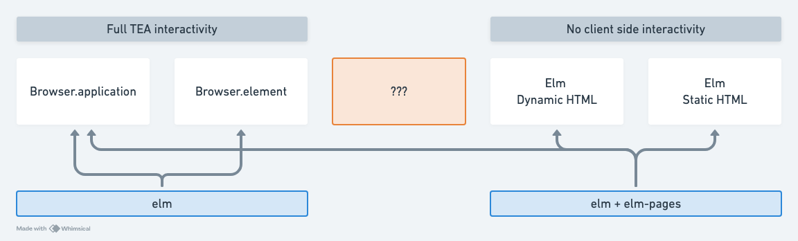
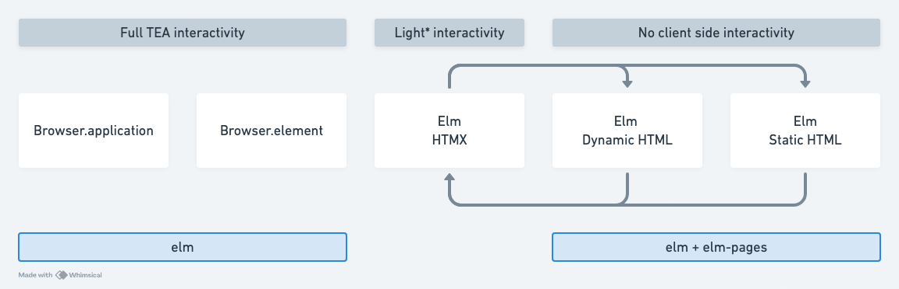
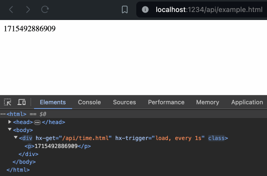

Is this cursed? Maybe!

This was a fun little experiment based on encouragement from a friend, but I'm not sure if I'll take it further from here! Downsides are listed at the end of this readme.

That said, if someone would like to take the `Htmx` module API coverage further, PRs are welcome!


## But why?

Our choices today for client-side (i.e. browser) interactivity with Elm go roughly like this:



With Elm we have our normal "The Elm architecture" (TEA) – it's a full blown client-side deal, broadly meaning we can:

1. `Browser.application`: take over the whole page SPA style
2. `Browser.element`: take over one or more parts of the page
3. `elm-pages` static html: server-side rendered HTML with Elm, but then `Browser.application` attaches on the client side
4. `elm-pages` dynamic pages: server-side dynamically rendered HTML with Elm, but then `Browser.application` attaches on the client side after response – has the ability to handle form POSTs

But what if we wanted something in between?*

<sup>*just to be clear elm-pages makes it rather painless to add additional pages, so this is not to imply we're solving an elm-pages defficiency, it's more just noting some context for this exploration</sup>

## An alternative universe where HTML did more than stop at &lt;a&gt; and &lt;form&gt;

This is more or less the premise of HTMX – why did HTML stop at `<a>` and `<form>` for client-side interactivity? Why not have more declarative ways to add interactivity to the web?

I won't butcher the premise further, you can read [all their essays and memes](https://htmx.org/essays/) if that's of interest.

The interesting part here is that `elm-pages` has a philosophy of [Use the Platform](https://elm-pages.com/docs/use-the-platform/), and HTMX has a philosophy of "what if the platform was more capable".


## Elm: how would we "use the platform" if it were more capable?

So lets say in this alternate universe, HTML had developed more interactivity features over the years.

elm-pages's dynamic/static HTML scenarios (3)/(4) become interesting in the same way `<form>` POSTS are: certain kinds of interactivity for raw HTML without needing to use JavaScript:



Now via (type safe!) HTML constructed with Elm, we can express certain kinds of declarative interactivity, that _doesn't_ involve Elm's TEA.

For example, here's an elm-pages endpoint that returns a HTML page with the current server timestamp:

```elm
apiExample =
    htmlRouteWithNow "api/example.html"
        (\now ->
            html
                [ head
                    [ title "Elm + HTMX!"
                    , script "https://unpkg.com/htmx.org@1.9.12"
                    ]
                , body []
                    [ div
                        [ Htmx.get "/api/time.html"
                        , Htmx.trigger "load, every 1s"
                        ]
                        [ p <| String.fromInt <| Time.posixToMillis now ]
                    ]
                ]
        )
```

This is all basic HTML, but in this alternate universe the HTML standard has some additional attributes.

Lets pretend `htmx` is a polyfill for these HTML extensions that exist in this other universe (non-hyothetically hypothetically speaking).

Here we're using two attributes:

- [`hx-get`](https://htmx.org/attributes/hx-get/) instructs the browser to fetch the given URL and replace the element's content with the response
- [`hx-trigger`](https://htmx.org/attributes/hx-trigger/) instructs the browser on when to fetch the URL – in this instance we've set it to fetch immediately on load, and then every 1 second.

Here's the `/api/time.html` route:


```elm
apiTime =
    htmlRouteWithNow "api/time.html"
        (\now ->
            p (now |> Time.posixToMillis |> String.fromInt)
        )
```

And here's what it looks like in action:



See the [example](./example/Api.elm) directory for the full code.


## Downsides in the Elm context

- It's not super clear when one should stop using HTMX and switch to full Elm interactivity. There's also the problem of the further you go with HTMX, the more you potentially have to rewrite when you need to swap to Elm...
  - Except! Given we wrote our HTML in Elm, we *could* simply move the entire Elm view function over to a new TEA page initially – the HTMX should still work identically. Then start adding/converting further interactivity as needed...
  - Except–except! HTMX *may* cause Elm VDOM rendering issues in a similar way to when browser extensions modify the DOM. This is a general issue with JS SPA frameworks and browser extensions, and it's possible HTMX could cause similar issues, I've not tested it in this scenario yet, but as long as the HTMX snippets remain static a keyed node should fix this?
- HTMX is not a standard, and it's not clear if it will become one. So in effect you're sneakily buying into using a Javascript framework... sort of? More like a Javascript polyfill for hypothetical HTML extensions that don't actually exist. So it's a bit of a gamble to buy in, but it's also gaining popularity in a way that could perhaps influence the future of HTML!
- It would be nice if HTMX was more type-safe, i.e. in this example if we removed/renamed `/api/time.html` we wouldn't know until runtime that it was broken. This is a general problem with HTML, and it's why Elm is so nice to work with. This could however be improved in `elm-pages` i.e. by having an `Api.routes.time.url` construct that allows type-safe reference of actually defined routes.
- Most of the [HTMX Examples](https://htmx.org/examples/) are just HTMX but [some still](https://htmx.org/examples/file-upload/) [use JS](https://htmx.org/examples/edit-row/) – so beware as you're tempted to get fancier with HTMX – thought it's also [surprising how much you can do](https://htmx.org/examples/progress-bar/).
- HTMX debugging will require an additional JS script: [https://htmx.org/extensions/debug/](https://htmx.org/extensions/debug/)
- HTMX has a different security model to Elm: [https://htmx.org/docs/#security](https://htmx.org/docs/#security)
